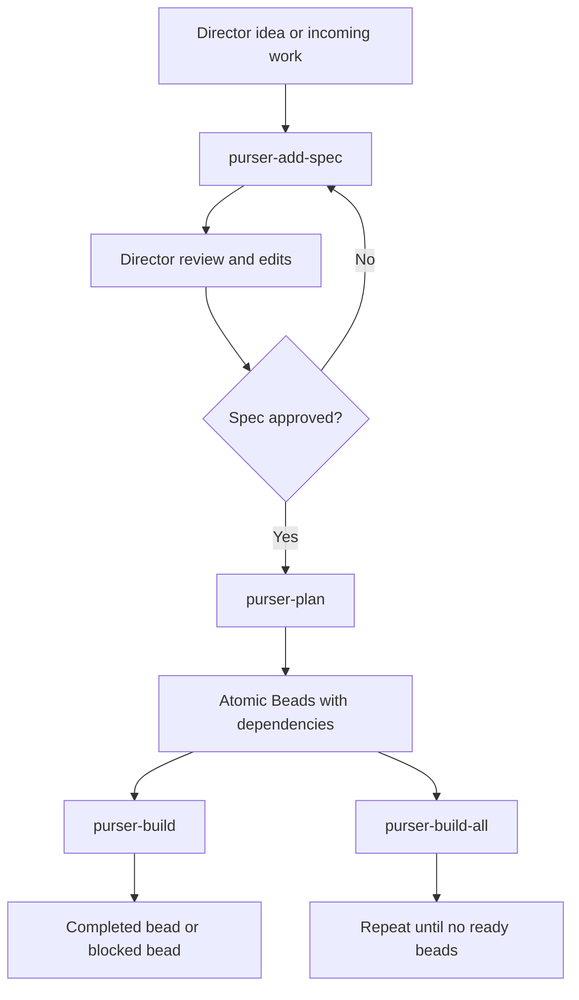
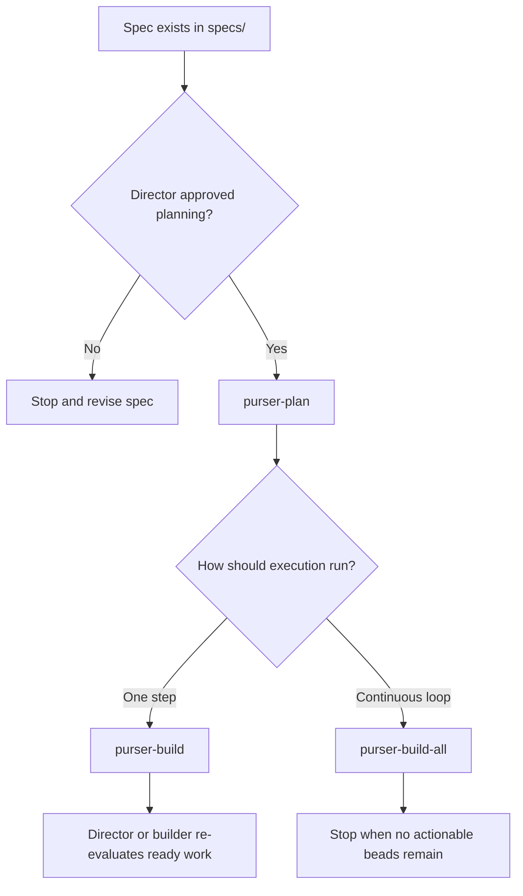
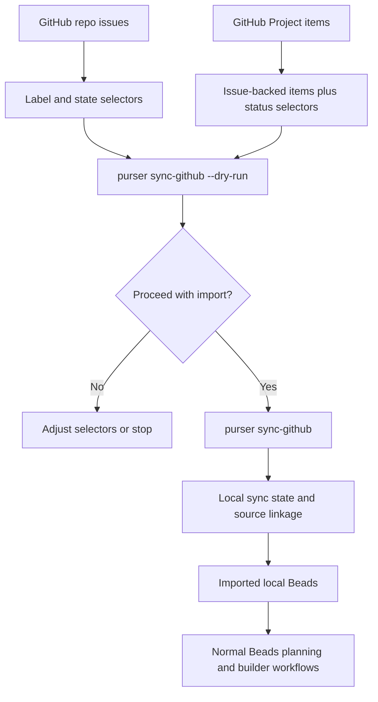
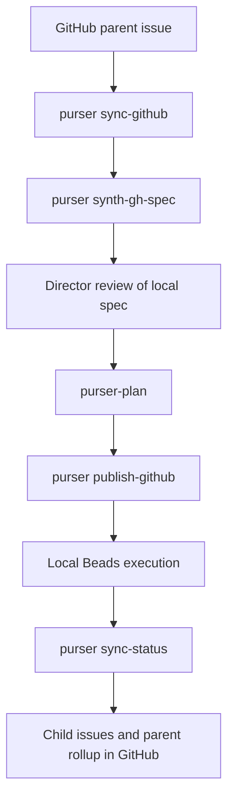

# Purser

Purser is a portable agent-workflow scaffold for three roles:

- The director works with a project manager agent to produce spec markdown files.
- The project manager agent decomposes approved specs into atomic Beads issues/tasks.
- The builder agent executes one bead at a time or runs a full Ralph loop until no actionable beads remain.

The framework keeps one canonical prompt catalog and emits agent-specific entry points for:

- Claude slash commands
- VS Code GitHub Copilot prompt files
- Codex prompt rendering through the `purser` CLI

The repository can also keep reusable plain-markdown tool skills under
`skills/` for Codex, Claude, and GitHub Copilot to reference directly.

## Director Quickstart

If you are directing work in a Purser-managed repo, the operating sequence is:

1. Create or refine a spec.
2. Review and explicitly approve that spec.
3. Run planning to convert the approved spec into atomic Beads.
4. Run either one builder step at a time or a full Ralph loop.
5. Optionally intake tagged GitHub issues or issue-backed project items into
   Beads before execution begins.
6. Optionally mirror planned and completed execution work back to GitHub.

The rest of this README explains that lifecycle, the command entry points, and
the GitHub intake path in the order a director normally encounters them.

## Lifecycle

Purser separates responsibilities cleanly:

- The director decides what should be built and approves the spec before
  planning begins.
- The project manager agent turns approved specs into Beads work.
- The builder agent executes one bead at a time or runs continuously until no
  actionable beads remain.

The intended lifecycle is strict:

1. Run `purser-add-spec` to create or refine a spec file only.
2. Stop for director review and manual edits.
3. Run `purser-plan` only after the director explicitly approves the spec for
   planning.
4. Run builder workflows only after planning has produced atomic beads.

This is the main operating flow a director is controlling:



The key approval boundary is between spec creation and planning. Purser expects
the project manager to stop after the spec is written and wait for explicit
director approval before Beads are created.



## Install

```bash
uv sync --group dev
uv run purser init
```

If you want `purser` available on your PATH as a reusable tool instead of only
through `uv run`, install it as a uv tool:

```bash
uv tool install /path/to/portable-tool
cd /path/to/existing-repo
purser init
```

`purser init` is repo-root aware and idempotent. When run anywhere inside an
existing Git repository, it resolves the repository root and then:

- scaffolds Purser prompt files under `.purser/`, `.claude/commands/`, and `.github/prompts/`
- creates `specs/.gitkeep` and `.purser/README.md`
- initializes or bootstraps the local `bd` and Dolt state in `.beads/`
- appends a Purser-owned section to `AGENTS.md` without overwriting existing instructions
- optionally creates `.purser/github-sync.json` when GitHub intake is requested

The generated scaffold includes these repo-local files:

- `.purser/commands/*.md`
- `.purser/codex/*.md`
- `.claude/commands/*.md`
- `.github/prompts/*.prompt.md`
- `specs/.gitkeep`
- `.purser/README.md`

Those are generated outputs of `purser init`. This repository keeps the source
templates in `src/purser/` and does not check the generated prompt artifacts or
fresh scaffolding outputs into the release package.

Beads prerequisites:

- `bd` must be installed and on PATH
- `dolt` must be installed and on PATH

## Command entry points

These are the main repo-local commands a director or operator needs to know:

```bash
uv run purser list
uv run purser prompt purser-add-spec --agent codex
uv run purser init --force
purser init --github
purser init --github --github-project-number 7
purser synth-gh-spec issue:owner/repo#123
purser publish-github specs/2026-04-06-demo.md
purser sync-status
uv run purser check
uv run purser sync-github --dry-run
uv run python -m purser.cli list
```

Available workflows:

- `purser-add-spec`: project manager prompt for creating a detailed spec in `specs/`
- `purser-plan`: project manager prompt for turning director-approved specs into Beads with dependencies
- `purser-build`: builder prompt for exactly one actionable bead
- `purser-build-all`: builder prompt for a sequential Ralph loop over all actionable beads

Operational commands:

- `sync-github`: intake eligible GitHub repo issues and GitHub Project items into local Beads
- `synth-gh-spec`: generate a local spec from an imported GitHub parent issue
- `publish-github`: mirror planned Beads linked to a spec into GitHub child issues
- `sync-status`: mirror local Beads execution state back to published GitHub issues and parent rollups

## GitHub intake

Purser includes a first-pass GitHub intake command for repositories that want to
pull tagged GitHub work into local Beads before or during execution planning:

```bash
uv run purser sync-github --print-config-template > .purser/github-sync.json
uv run purser sync-github --config .purser/github-sync.json --dry-run
uv run purser sync-github --config .purser/github-sync.json
```

You can also ask `purser init` to seed that config:

```bash
purser init --github
purser init --github --github-project-owner owner --github-project-number 7
```

When `--github` is used, Purser tries to auto-discover the GitHub repository
from `remote.origin.url`. If discovery is not possible and the session is
interactive, it asks for the missing repo or project details. Existing
`.purser/github-sync.json` content is preserved unless `--force` is passed.

The intake path is explicit and selector-based. Purser does not import every
open GitHub issue by default, and the current feature is an intake workflow, not
full bidirectional synchronization.



After intake, the imported work follows the same local Beads execution path as
planned work. The sync command links GitHub source items to local Beads and can
re-run idempotently, but it does not turn GitHub into the live execution engine.

GitHub-backed planning flow:



Recommended sequence:

```bash
purser sync-github --dry-run
purser sync-github
purser synth-gh-spec issue:owner/repo#123
# director reviews specs/...
# project manager runs purser-plan and creates beads with "Spec path: specs/..."
purser publish-github specs/2026-04-06-demo.md
purser sync-status
```

V1 contract:

- Repository issue sources use explicit label selectors.
- GitHub Project sources use issue-backed project items only.
- Project intake filters by a named status field plus allowed status values.
- Project sources can also require labels on the underlying GitHub issue.
- Re-import is idempotent through `.purser/github-sync-state.json`.
- Dependency-like relationships are translated into Beads dependencies when both
  sides exist locally.
- Parent-child relationships are recorded explicitly in sync state for operator
  visibility rather than being forced into Beads dependency edges.
- Published GitHub child issues are created from local Beads linked by spec path.
- Beads remains authoritative for execution status; `purser sync-status` mirrors
  outward to GitHub.
- Parent issue auto-close is configurable and defaults to on.

See `docs/github-sync.md` for the operator workflow and the JSON config format.

## Beads workflow

The generated prompts assume Steve Yegge's Beads CLI is available in the repo
environment and that agents can use:

- `bd create`
- `bd update`
- `bd ready`
- `bd show`
- `bd close`

The planning prompt explicitly requires atomic beads with explicit dependencies
so the builder can safely work one bead at a time.

## Cross-agent behavior

Claude and Copilot get repo-local prompt files with the same base command names. Codex does not support repo-local slash commands, so the portable fallback is:

```bash
uv run purser prompt purser-add-spec --agent codex
```

That prints the Codex-ready version of the prompt so it can be pasted into the active session.

All three agent renderers are built from the same source template body in
`src/purser/templates.py`, with only a small agent-specific usage note added by
the renderer.

## Skills

Tool-specific skills live in plain repo-local markdown under `skills/`. They are
not generated by `purser init`.

Current layout:

- `skills/README.md`: top-level discovery guidance
- `skills/<tool>/SKILL.md`: one primary skill file per tool or skill family

Current skills:

- `skills/github-cli/SKILL.md`
- `skills/duckdb/SKILL.md`

This layout is intended to scale to future tools without restructuring the
repository again.

## VS Code Task

This repo includes a VS Code task for local initialization:

- `Pulser - Initialize`: runs `uv run purser init`

## Verification

This repo is intended to be managed through `uv`, and the framework treats static analysis and tests as required backpressure:

```bash
uv run purser check
```

That runs:

- `uv run --group dev ruff check`
- `uv run --group dev ty check`
- `uv run --group dev pytest`
- `uv run python -m compileall`
